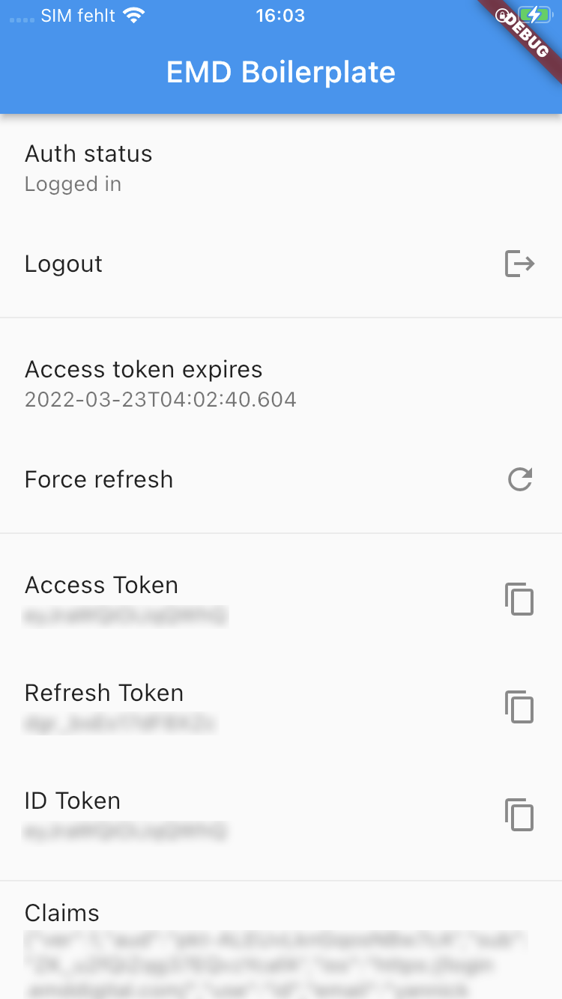
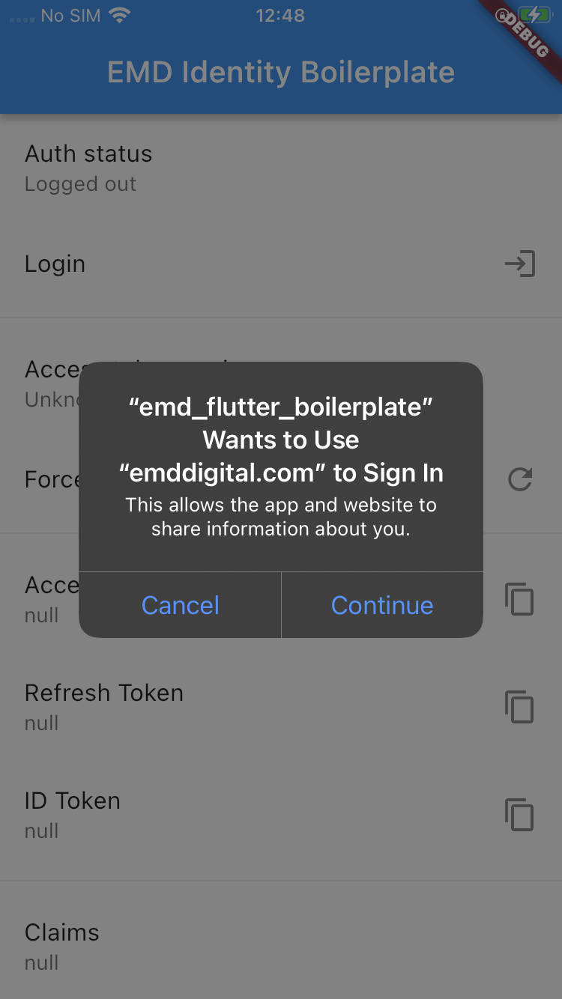
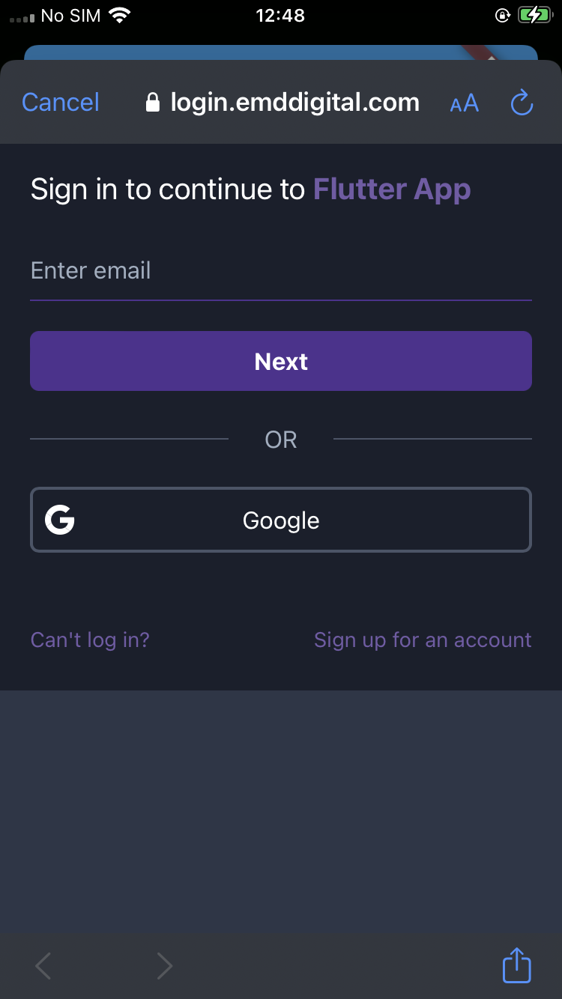
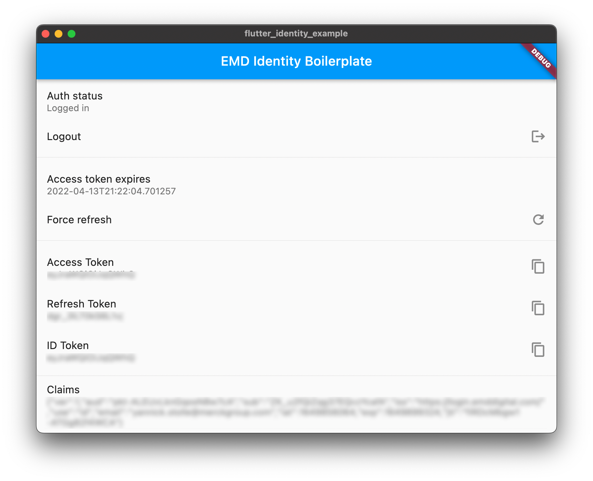

# Flutter identity example

Example implementation of the identity platform in Flutter.

## Getting Started

For help getting started with Flutter, view the
[online documentation](https://flutter.dev/docs), which offers tutorials,
samples, guidance on mobile development, and a full API reference.

## Please refer to the guide in the identity docs

// TODO Link

## Credential storage

This example implementation stores the tokens using `flutter_secure_storage` package. This persists to iOS Keychain and Secured preferences. Follow the instructions [here](https://pub.dev/packages/flutter_secure_storage) to enable the right permissions for your application targets.

## Desktop authentication

Since `flutter_appauth` currently does not support running on desktop platforms there's an implementation of authorization with PKCE in the `lib/services/auth/desktop` folder.

### Authentication steps on desktop:

* Discovery URL is called to fetch the authorization endpoint for oAuth.
* A check if the server supports the S256 code challenge method is performed. Authentication will fail if the server does not include S256 in the response to the discovery request (`code_challenge_method`)
* A challenge is generated using secure crypto randoms and hashed using SHA256. The has is included as Base64URl string to the server.
* The app launches a browser window for authenticating the user. Included in the url is the redirect url for the local loopback server that will process the authentication code
* The server is started once the browser was opened. 
* Once the authentication flow is completed the user is redirected to the local server, with the authentication code as a query parameter.
* The app requests the tokens with the authentication code and raw challenge to verify the request

ℹ️ The default port for the local loopback server is 8080 

ℹ️ The url will be opned using the `url_launcher` package. This opens the defaul tbrowser of the platform by default.

